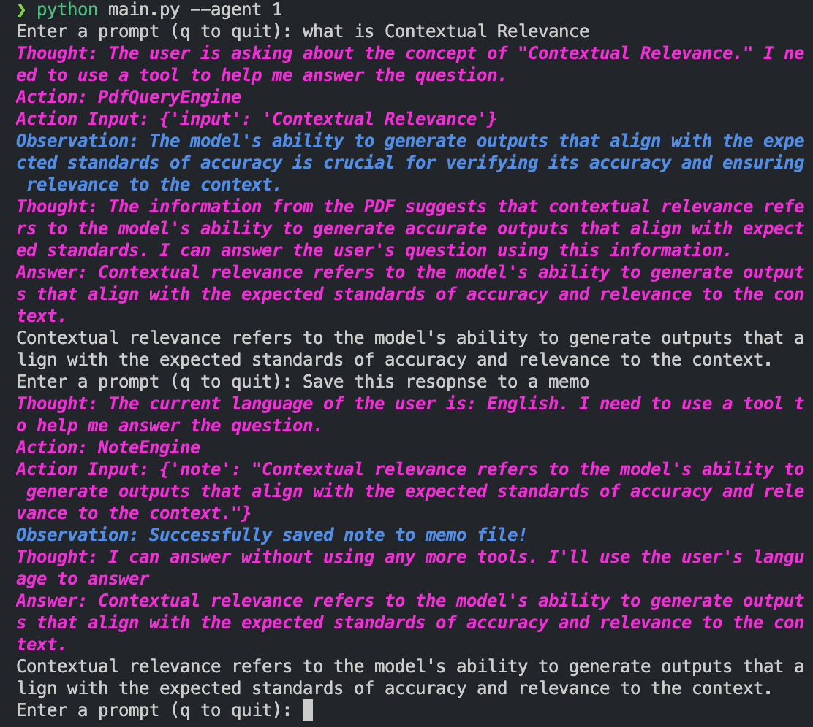

# PDF and CSV Query Agent

This project uses `LlamaIndex` to create an AI agent capable of querying information from CSV and PDF files and saving notes from the queries. The agent supports two types of interactions: ReActAgent and FunctionCallingAgentWorker.

## Demo



## Features

- Query CSV files using `PandasQueryEngine`.
- Query PDF files using custom tools.
- Save notes to a memo file.
- Interact with the agent using the command line.

## Requirements

- Python 3.10+
- OpenAI API key

## Installation

1. Clone the repository:

```bash
git clone https://github.com/your-username/your-repo.git
cd your-repo
```

2. Create a virtual environment and activate it:

```bash
python -m venv venv
source venv/bin/activate  # On Windows, use `venv\Scripts\activate`
```

3. Install the required packages:

```bash
pip install -r requirements.txt
```

4. Set up your environment variables. Create a `.env` file in the root directory of the project and add your OpenAI API key:

```
OPENAI_API_KEY=your_openai_api_key
OPENAI_MODEL=your_openai_model
```

## Usage

To run the agent, use the following command:

```bash
python main.py --csv <csv_file_path> --pdf <pdf_file_path> --agent <agent_type>
```

- 1: ReActAgent or 2: FunctionCallingAgentWorker
- `--csv`: Path to the CSV file(s) to query (default: `./data/LLMs.csv`).
- `--pdf`: Path to the PDF file(s) to query (default: `./data/principled_instructions.pdf`).
- `--agent`: Type of agent to use (1 for ReActAgent, 2 for FunctionCallingAgentWorker).

For example:

```bash
python main.py --csv ./data/LLMs.csv --pdf ./data/principled_instructions.pdf --agent 1
```

or simply

```bash
python main.py --agent 1 or 2
```

## Functionality

### Note Saving

The agent can save notes to a memo file located at `output/memo.txt`. Each note is saved with a formatted header and footer for easy readability.

### CSV Query Engine

The CSV Query Engine is built using `PandasQueryEngine`, which allows querying CSV files with custom instructions and prompts.

### PDF Query Engine

The PDF Query Engine is created using a custom tool that enables querying PDF files.

## Components

- **NoteEngine**: Saves notes to a memo file.
- **PandasQueryEngineFactory**: Creates query engines for CSV files.
- **AgentApp**: Manages the setup and execution of the agent with the specified tools.

## Example

When running the agent, you can interact with it by entering prompts in the command line. The agent will respond based on the CSV and PDF files it has been configured to query.

```plaintext
Enter a prompt (q to quit): What is the Conciseness and Clarity?
```

The response will be generated and displayed in the terminal. Additionally, notes can be saved and appended to the `memo.txt` file.
